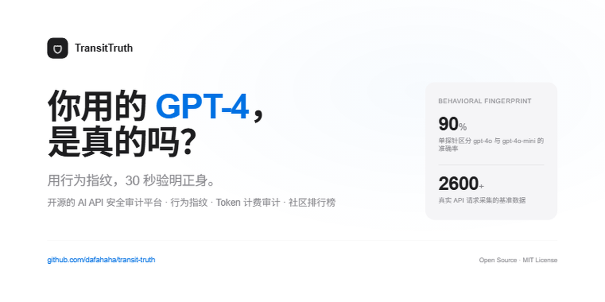

# TransitTruth 🛡️



> **AI API 安全审计平台** — 用行为指纹验证你用的 GPT-4 是真的吗？30秒测出答案。

---

## 🔥 我们发现了什么？

我们用27分钟、2600次API请求，发现了GPT模型的"行为指纹"：

| 探针 | gpt-4o-mini | gpt-4o | 正常随机 |
|---|---|---|---|
| 选1-10的数字 | **7（100%）** | 7（98%） | 每个数字10% |
| 掷骰子 | **4（96%）** | 4（56%） | 每个数字16.7% |
| 选随机动物 | Dolphin（16%） | **Okapi（76%!）** | 均匀分布 |
| 选随机字母 | **G（40%）** | **K（44%）** | 每个字母3.8% |
| 选颜色 | Cerulean（74%） | Cerulean（92%） | 均匀分布 |

**关键发现：**
- gpt-4o-mini选1-10的数字，**100%返回7**（零方差！）
- gpt-4o选随机动物，**76%返回Okapi**（㺢㹢狓，罕见非洲长颈鹿近亲）
- **只用"选一个随机动物"这一个探针，就能以90%准确率区分gpt-4o和gpt-4o-mini**——这是tokenizer指纹做不到的（两个模型用同一个o200k tokenizer）

这些"行为指纹"是训练数据和RLHF的产物，中转站几乎不可能伪造。

---

## 这是什么？

TransitTruth 是一个开源的 **AI API 安全审计平台**，基于学术前沿的行为指纹技术（参考 [One Token Is Enough, arXiv:2607.10252](https://arxiv.org/abs/2607.10252)），帮助用户验证：

- **🔍 模型身份验证**：你付了GPT-4o的钱，实际用的是GPT-4o还是GPT-4o-mini？还是GPT-3.5？
- **💰 Token计费审计**：实际用1000 token，中转站收你1500 token的钱？
- **⚡ 性能监控**：延迟、可用性、错误率是否符合承诺？
- **📋 协议合规**：响应格式是否符合OpenAI API规范？
- **🏆 社区排行榜**：全民共建的中转站信誉排行榜

## 为什么需要这个？

2026年，AI API中转站市场乱象频发：

- **80%以上中转站存在模型偷偷降级**（用mini冒充pro，用3.5冒充4）
- Token计数虚高、费率暗增成为行业常态
- 跑路、数据倒卖、恶意代码注入时有发生
- 国家安全部已专门发布风险提示

但用户没有工具能验证自己用的中转站是否"参水分"。TransitTruth就是为了解决这个问题。

## 检测原理

### 1. 🧬 行为指纹（核心技术）

不同模型在"随机"任务上有极端强烈的分布偏好——这是训练数据和RLHF的产物，中转站几乎不可能伪造。

我们用8个行为探针（随机数、字母、颜色、动物、星期、掷骰子、抛硬币），每个采样10-50次，构建经验分布，然后用**卡方检验+KS检验+贝叶斯更新**对比基准分布，计算模型匹配的后验概率。

**实测效果：**
- gpt-4o-mini vs gpt-4o：6/8探针统计显著差异（p<0.05）
- 最强区分探针（选动物）：TVD=0.900，单探针90%准确率
- 整体验证：后验概率91.3%，95%可信区间[0.851, 0.960]

### 2. 🔤 Tokenizer指纹

不同模型家族使用不同的tokenizer（GPT用cl100k/o200k，Claude用自定义tokenizer，Gemini用SentencePiece）。发送精心构造的字符串（数字序列、CJK、emoji、代码、URL），对比token计数，可以反推后端模型家族。

**局限**：不能区分同一家族的不同模型（如gpt-4o vs gpt-4o-mini）——这正是行为指纹的价值。

### 3. 🧠 能力测试

简单推理题、代码生成题、指令跟随测试、多语言翻译，区分高/中/低等级模型。

### 4. 💰 Token计数对比

将中转站返回的token计数与本地tiktoken精确计算对比，检测是否存在计费膨胀。同时估算chat template overhead，避免误判。

### 5. ⚡ 延迟与协议检查

测量延迟分布（P50/P95/P99）、错误率，验证响应结构、错误格式、响应头是否符合OpenAI API规范。

## 快速开始

### 🚀 零安装在线Demo（推荐）

打开 [在线Demo](https://dafahaha.github.io/transit-truth/)，两种体验方式：
- **🎬 先看演示（无需 Key）**：一键体验完整审计流程，看到“声称 gpt-4o 实际降级”的典型场景
- 输入自己的 API Key：对你正在使用的中转站进行真实审计

所有请求直接从浏览器发出，**不需要后端服务器，不需要安装任何东西，API Key 不会经过任何服务器**。

### 🐳 使用Docker

```bash
docker-compose up -d
```

然后访问 http://localhost:8000

### 💻 本地运行

```bash
cd backend
pip install -r requirements.txt
uvicorn app.main:app --host 0.0.0.0 --port 8000
```

然后访问 http://localhost:8000

### 📦 CLI一行命令

```bash
pip install transit-truth
transit-truth sk-your-api-key --base-url https://your-relay.com/v1 --model gpt-4o
```

## 使用方法

1. 打开Web界面或在线Demo
2. 输入中转站的API Key、Base URL、模型名称
3. （可选）输入官方API Key用于精确对比
4. 选择检测模式：快速（3探针，~10秒）/ 深度（10探针，~60秒）
5. 点击"开始审计"
6. 查看审计结果、行为指纹分布图、详细报告
7. （可选）一键贡献到社区排行榜

## 功能特性

### ✅ 已实现
- [x] **行为指纹验证**（14个行为探针：8英文+6中文，卡方检验+KS检验+贝叶斯更新）
- [x] **Tokenizer指纹**（8个tokenizer探针）
- [x] **能力测试**（10个能力探针，模型等级估算）
- [x] **Token计费审计**（tiktoken精确计算，差异率检测）
- [x] **延迟与协议检查**（P50/P95/P99，7项协议合规）
- [x] **余额查询**（多中转站账户余额聚合，低余额自动告警）
- [x] **统计不确定性量化**（Wilson置信区间+样本量评估+95%可信区间）
- [x] **生产级弹性机制**（指数退避重试+限流检测+断路器模式+详细日志）
- [x] **模型参考数据**（14个模型的公开数据：价格/ELO/智能指数/延迟）
- [x] **Web UI**（4个Tab，步骤式表单，进度条，苹果风格设计）
- [x] **纯前端在线Demo**（零安装，浏览器即用）
- [x] **CLI工具**（一行命令审计+余额查询）
- [x] **HTML报告生成**（可分享的审计报告）
- [x] **审计结果分享卡片**（1200x630 PNG，一键下载分享社交媒体）
- [x] **社区排行榜**（全民共建，贡献者信誉系统）
- [x] **持续监控+告警**（4种告警检测，4种告警通道）
- [x] **真实基准数据库**（gpt-4o-mini、gpt-4o，各50样本）
- [x] **灵活配置管理**（12个环境变量，支持自定义探针数量/超时/重试等）
- [x] **46个单元测试+15个集成测试框架**（全部通过）
- [x] **CI/CD**（GitHub Actions，Python 3.10/3.11/3.12矩阵）

### 🚧 开发中
- [ ] 更多模型基准数据（Claude、Gemini、Llama、Qwen）
- [ ] 增加基准样本量到200+（当前50样本，统计误差约±14%）
- [ ] 浏览器插件（实时审计正在使用的API）
- [ ] 移动端适配

## 学术背景

本项目基于以下学术研究：

- **[One Token Is Enough](https://arxiv.org/abs/2607.10252)** (arXiv:2607.10252, 2026) — 单token输出分布的模型指纹方法，165个模型验证，EER 7.3%
- **[CoIn](https://arxiv.org/abs/2505.13778)** (arXiv:2505.13778, 2025) — API模型替换检测框架
- **[RoFL](https://arxiv.org/abs/2505.12682)** (arXiv:2505.12682, 2025) — 鲁棒模型指纹，抗微调/剪枝/量化
- **[Model Provenance Testing](https://arxiv.org/abs/2502.00706)** (arXiv:2502.00706, 2025) — 黑盒模型来源测试

我们的贡献：
1. **同家族细粒度区分**：首次系统验证行为指纹能区分gpt-4o和gpt-4o-mini（TVD最高0.900）
2. **工程化全功能平台**：不只是指纹工具，而是完整的API安全审计平台
3. **中文社区优先**：面向中文用户，解决国内中转站乱象
4. **零门槛在线Demo**：纯前端实现，浏览器即用

## 真实基准数据

我们开源了真实采集的模型基准数据（不是合成数据）：

| 模型 | 样本数 | 探针数 | 总请求 | 采集时间 | 文件 |
|---|---|---|---|---|---|
| gpt-4o-mini | 50 | 26 | 1300 | 15分钟 | `data/baselines/gpt-4o-mini.json` |
| gpt-4o | 50 | 26 | 1300 | 12分钟 | `data/baselines/gpt-4o.json` |

数据采集脚本：`collect_baseline.py`（支持并发，零成本，用任何OpenAI兼容API即可）

## 实验报告

完整的实验报告（含方法论、数据分析、跨模型对比、统计检验）：[docs/experiment_report.md](docs/experiment_report.md)

核心结论：
- 行为指纹能区分同家族不同模型（tokenizer指纹做不到）
- 最强区分探针TVD=0.900，单探针90%准确率
- 统计方法验证：91.3%后验概率正确识别
- 零成本：2600次API请求，用免费中转站key即可完成

## 项目结构

```
transit-truth/
├── backend/                    # Python后端
│   ├── app/
│   │   ├── core/              # 核心引擎
│   │   │   ├── auditor.py          # 审计引擎
│   │   │   ├── fingerprint.py      # 模型指纹（行为+tokenizer）
│   │   │   ├── token_check.py      # Token验证
│   │   │   ├── latency_protocol.py # 延迟/协议检测
│   │   │   ├── probes.py           # 探针集（26个：14行为+8 tokenizer+4能力）
│   │   │   ├── statistical_analyzer.py  # 统计分析（KS+卡方+贝叶斯+Wilson置信区间）
│   │   │   ├── retry.py            # 重试和弹性工具（指数退避+限流检测+断路器）
│   │   │   ├── balance_checker.py  # 余额查询（8端点+5格式+批量+告警）
│   │   │   ├── model_reference.py  # 模型参考数据（14个模型的公开数据）
│   │   │   ├── monitor.py          # 持续监控+告警
│   │   │   └── benchmark_collector.py   # 基准数据收集
│   │   ├── api/               # REST API
│   │   ├── utils/             # 工具函数
│   │   ├── config.py          # 配置管理（12个环境变量）
│   │   ├── tests/             # 46个单元测试+15个集成测试
│   │   └── main.py            # FastAPI入口
│   └── requirements.txt
├── frontend/                   # Web前端
│   ├── index.html
│   ├── css/style.css
│   └── js/app.js
├── standalone/                 # 纯前端在线Demo（零安装）
│   └── index.html              # 55KB单文件，苹果风格，浏览器即用
├── data/
│   └── baselines/              # 真实基准数据
│       ├── gpt-4o-mini.json
│       └── gpt-4o.json
├── docs/
│   ├── experiment_report.md    # 完整实验报告（23.7KB）
│   ├── architecture.md         # 架构文档
│   ├── methodology.md          # 技术原理文档
│   ├── blog_post.md            # 爆文（《我用27分钟发现了GPT的"行为指纹"》）
│   ├── banner_1280x640.png    # 宣传图（苹果风格）
│   ├── demo.gif                # 功能演示GIF
│   └── demo.mp4                # 功能演示MP4
├── collect_baseline.py         # 基准数据采集脚本（支持并发）
├── analyze_baseline.py         # 基准数据分析脚本
├── compare_models.py           # 跨模型对比分析脚本
├── Dockerfile
├── docker-compose.yml
├── pyproject.toml              # Python包配置（支持pip install）
├── CHANGELOG.md
├── CONTRIBUTING.md
├── CODE_OF_CONDUCT.md
├── LICENSE                     # MIT
└── README.md
```

## 贡献指南

我们欢迎所有形式的贡献！

- **提交基准数据**：用`collect_baseline.py`采集你常用模型的基准数据，提交PR
- **贡献审计结果**：用工具审计你用的中转站，一键贡献到排行榜
- **开发新功能**：看GitHub Issues，认领任务
- **写文档/教程**：帮助更多人用上这个工具
- **报告Bug**：提交Issue，我们会尽快修复

详见 [CONTRIBUTING.md](CONTRIBUTING.md)

## 免责声明

1. 本工具仅供学习和研究使用，请勿用于非法用途
2. 审计结果基于统计分析，仅供参考，不构成法律证据
3. 请遵守目标API服务的使用条款，不要对服务造成过大压力
4. 标记中转站为"可疑"不等于"确定造假"，请结合多方面信息判断
5. 本工具不对任何中转站的商业行为负责

## 许可证

MIT License

## 联系方式

- GitHub Issues：https://github.com/dafahaha/transit-truth/issues
- 邮箱：156556011+dafahaha@users.noreply.github.com

---

**如果你觉得这个工具有用，请给个Star ⭐，让更多人看到。**

> "你用的GPT-4是真的吗？30秒测出答案。"
