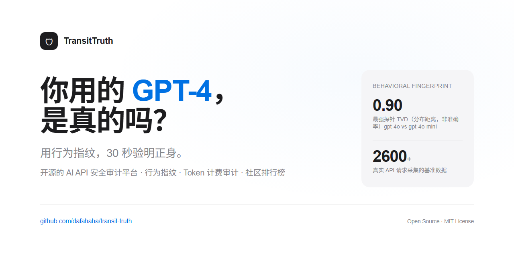

# TransitTruth 🛡️



> **AI API 安全审计平台** — 用行为指纹验证你用的 GPT-4 是真的吗？30秒测出答案。

---

## 🔥 我们发现了什么？

我们用27分钟、2600次API请求，发现了GPT模型的"行为指纹"：

| 探针 | gpt-4o-mini | gpt-4o | 正常随机 |
|---|---|---|---|
| 选1-10的数字 | **7（100%）** | 7（98%） | 每个数字10% |
| 掷骰子 | **4（96%）** | 4（56%） | 每个数字16.7% |
| 选随机动物 | Dolphin（16%） | **Okapi（76%!）** | 均匀分布 |
| 选随机字母 | **G/M（并列 40%）** | **K（44%）** | 每个字母3.8% |
| 选颜色 | Cerulean（74%） | Cerulean（92%） | 均匀分布 |

**关键发现：**
- gpt-4o-mini选1-10的数字，**100%返回7**（零方差！）
- gpt-4o选随机动物，**76%返回Okapi**（㺢㹢狓，罕见非洲长颈鹿近亲）
- 用"响应是否为 Okapi"这条简单规则，在**同一基准样本上**做重代入（resubstitution）得到 **88% 准确率**（Wilson 95%CI [0.80, 0.93]，bootstrap [0.81, 0.94]）。注意：动物探针的 TVD=0.90 是**分布距离**，不是分类准确率；这是 in-distribution 自洽检验，不是独立 held-out 准确率。

> **效度说明（务必先读）**：上述基准均通过**单个 OpenAI 兼容中转站（wolfai.top）**采集，**不是官方端点**。我们只声称"在该中转站，两个标称端点呈现可区分的行为画像"，不声称是与厂商无关的模型指纹；基准本身也继承了中转站实际提供的模型。官方金标准基线需要官方 API 访问，属未来工作。

这些"行为指纹"是训练数据和 RLHF 的产物；要在真实流量上伪造它，中转站需要实际返回真模型、后处理输出分布，或微调一个替身模型——成本不低，但并非"不可能"。

---

## 这是什么？

TransitTruth 是一个开源的 **AI API 安全审计平台**，基于学术前沿的行为指纹技术（参考 [One Token Is Enough, arXiv:2607.10252](https://arxiv.org/abs/2607.10252)），帮助用户验证：

- **🔍 模型身份验证**：你付了GPT-4o的钱，实际用的是GPT-4o还是GPT-4o-mini？还是GPT-3.5？
- **💰 Token计费审计**：实际用1000 token，中转站收你1500 token的钱？
- **⚡ 性能监控**：延迟、可用性、错误率是否符合承诺？
- **📋 协议合规**：响应格式是否符合OpenAI API规范？
- **🏆 社区排行榜**：全民共建的中转站信誉排行榜

## 为什么需要这个？

通过中转站（relay）使用 LLM API 时，用户无法在技术上确认"应答的模型就是付费的那个"。由于大模型单价更高，中转站有经济动机用更小/更便宜的模型顶替旗舰模型，同时按旗舰计费。已有学术审计在商业端点上记录了此类模型替换与静默降级现象（见 [arXiv:2504.04715](https://arxiv.org/abs/2504.04715)）。Token 计数虚高、费率不透明等问题也让自验证变得有必要。

但普通用户没有工具能核查自己用的中转站是否"参水分"。TransitTruth 就是为了给用户一个低成本、可复现的核查手段。

## 检测原理

### 1. 🧬 行为指纹（核心技术）

不同模型在"随机"任务上有强烈的分布偏好——这是训练数据和 RLHF 的产物。我们用 8 个行为探针（随机数、字母、颜色、动物、星期、掷骰子、抛硬币），每个采样 50 次，构建经验分布，再用**卡方检验 + KS 检验 + 贝叶斯更新**对比基准分布，计算模型匹配的后验概率。

> 响应做了归一化（如 "Heads." 与 "Heads" 合并、大小写统一）。

**实测效果（同一中转站两个标称端点）：**
- gpt-4o-mini vs gpt-4o：**5/8 探针**统计显著差异（p<0.05；抛硬币探针在归一化后 TVD=0.08、p=0.092，不再显著）
- 最强区分探针（选动物）：TVD=0.90；"是否为 Okapi"规则的重代入准确率 **88%**（Wilson [0.80,0.93]）。TVD 是分布距离，不等于准确率。
- 整体管线：后验概率 **0.913**，95% 可信区间 [0.885, 0.937]。这是**基线样本对自身参考的 in-distribution resubstitution（自洽性检验）**，用于验证管线内部一致；**不是**独立数据上的 held-out 检测准确率。

### 2. 🔤 Tokenizer指纹

不同模型家族使用不同的tokenizer（GPT用cl100k/o200k，Claude用自定义tokenizer，Gemini用SentencePiece）。发送精心构造的字符串（数字序列、CJK、emoji、代码、URL），对比token计数，可以反推后端模型家族。

**局限**：不能区分同一家族的不同模型（如gpt-4o vs gpt-4o-mini）——这正是行为指纹的价值。

### 3. 🧠 能力测试

简单推理题、代码生成题、指令跟随测试、多语言翻译，区分高/中/低等级模型。

### 4. 💰 Token计数对比

将中转站返回的token计数与本地tiktoken精确计算对比，检测是否存在计费膨胀。同时估算chat template overhead，避免误判。

### 5. ⚡ 延迟与协议检查

测量延迟分布（P50/P95/P99）、错误率，验证响应结构、错误格式、响应头是否符合OpenAI API规范。

## 快速开始

### 🚀 零安装在线Demo（推荐）

打开根目录 [index.html](index.html)（GitHub Pages: https://dafahaha.github.io/transit-truth/），两种体验方式：
- **🎬 先看演示（无需 Key）**：一键体验完整审计流程，看到"声称 gpt-4o 实际降级"的典型场景
- 输入自己的 API Key：对你正在使用的中转站进行真实审计

所有请求直接从浏览器发出，**不需要后端服务器，不需要安装任何东西，API Key 不会经过任何服务器**。

> 注：`standalone/index.html` 现为跳转到根 `index.html` 的重定向页。

### 🐳 使用Docker

```bash
docker-compose up -d
```

然后访问 http://localhost:8000

> 部署注意：compose 已显式 `user: "1000:1000"`（与 Dockerfile 内 `appuser` 对齐）。`./data` 挂载到容器 `/app/data` 后，该目录属主由**宿主目录**决定；若宿主 `./data` 对 UID 1000 不可写，请先在宿主 `sudo chown -R 1000:1000 ./data`，否则首次写 SQLite 会因 EACCES 返回 500。

### 💻 本地运行

```bash
cd backend
pip install -r requirements.txt
uvicorn app.main:app --host 0.0.0.0 --port 8000
```

然后访问 http://localhost:8000

### 📦 从源码安装（CLI）

PyPI 上**没有** `transit-truth` 包，请从源码安装：

```bash
git clone https://github.com/dafahaha/transit-truth.git
cd transit-truth
pip install -e .

transit-truth sk-your-key --base-url https://your-relay.com/v1 --model gpt-4o
```

（后端方式见上方"本地运行"：`cd backend; pip install -r requirements.txt`。）

## 使用方法

1. 打开Web界面或在线Demo
2. 输入中转站的API Key、Base URL、模型名称
3. （可选）输入官方API Key用于精确对比
4. 选择检测模式：快速（3探针，~10秒）/ 深度（10探针，~60秒）
5. 点击"开始审计"
6. 查看审计结果、行为指纹分布图、详细报告
7. （可选）提交审计结果到社区贡献队列（进入人工审核，审核通过后才计入排行榜）

## 功能特性

### ✅ 已实现
- [x] **行为指纹验证**（14个行为探针：8英文+6中文，卡方检验+KS检验+贝叶斯更新）
- [x] **Tokenizer指纹**（8个tokenizer探针）
- [x] **能力测试**（10个能力探针，模型等级估算）
- [x] **Token计费审计**（tiktoken精确计算，差异率检测）
- [x] **延迟与协议检查**（P50/P95/P99，7项协议合规）
- [x] **余额查询**（多中转站账户余额聚合，低余额自动告警）
- [x] **统计不确定性量化**（Wilson置信区间+样本量评估+95%可信区间）
- [x] **生产级弹性机制**（指数退避重试+限流检测+断路器模式+详细日志）
- [x] **模型参考数据**（14个模型的公开数据：价格/ELO/智能指数/延迟）
- [x] **Web UI**（4个Tab，步骤式表单，进度条，苹果风格设计）
- [x] **纯前端在线Demo**（零安装，浏览器即用）
- [x] **CLI工具**（一行命令审计+余额查询）
- [x] **HTML报告生成**（可分享的审计报告）
- [x] **审计结果分享卡片**（1200x630 PNG，一键下载分享社交媒体）
- [x] **社区排行榜**（全民共建，贡献者信誉系统）
- [x] **持续监控+告警**（4种告警检测，4种告警通道）
- [x] **真实基准数据库**（gpt-4o-mini、gpt-4o，各50样本）
- [x] **灵活配置管理**（12个环境变量，支持自定义探针数量/超时/重试等）
- [x] **测试**：实测 **95 collected / 88 passed / 7 skipped**；其中 7 个端到端集成测试需要真实 API key，用 `pytest -m integration` 单独运行
- [x] **CI/CD**（GitHub Actions，Python 3.10/3.11/3.12矩阵）

### 🚧 开发中
- [ ] 更多模型基准数据（Claude、Gemini、Llama、Qwen）
- [ ] 增加基准样本量到200+（当前50样本，统计误差约±14%）
- [ ] 浏览器插件（实时审计正在使用的API）
- [ ] 移动端适配

## 学术背景

本项目基于以下学术研究：

- **[One Token Is Enough](https://arxiv.org/abs/2607.10252)** (arXiv:2607.10252, 2026) — 单token输出分布的模型指纹方法，165个模型验证，EER 7.3%
- **[CoIn](https://arxiv.org/abs/2505.13778)** (arXiv:2505.13778, 2025) — 隐藏推理token计数审计框架，检测token数膨胀（94.7%成功率）
- **[RAFP](https://arxiv.org/abs/2505.12682)** (arXiv:2505.12682, 2025) — Rare-region 指纹，识别 LLM 谱系，对微调/量化稳健
- **[Model Provenance Testing](https://arxiv.org/abs/2502.00706)** (arXiv:2502.00706, 2025) — 黑盒模型来源测试

我们的工作定位：
1. **同家族细粒度区分**：在两个标称同家族端点（gpt-4o vs gpt-4o-mini）上展示行为画像可被区分（最强 TVD=0.90）；这是 tokenizer 指纹做不到的。我们**不**声称这是"首个"此类研究，也不声称已在独立 held-out 数据上验证泛化。
2. **工程化全功能平台**：不只是指纹工具，而是完整的API安全审计平台
3. **中文社区优先**：面向中文用户，解决国内中转站乱象
4. **零门槛在线Demo**：纯前端实现，浏览器即用

## 真实基准数据

我们开源了真实采集的模型基准数据（经同一 OpenAI 兼容中转站 wolfai.top 采集，非官方端点）：

| 模型 | 样本数 | 探针数 | 总请求 | 采集时间 | 文件 |
|---|---|---|---|---|---|
| gpt-4o-mini | 50 | 26 | 1300 | 15 分钟 | `data/baselines/gpt-4o-mini.json` |
| gpt-4o | 50 | 26 | 1300 | 12 分钟 | `data/baselines/gpt-4o.json` |

数据采集脚本：`collect_baseline.py`（支持并发，用任何 OpenAI 兼容 API 即可）；分布/TVD/卡方/分类器表格由 `docs/generate_tables.py` 从 JSON 自动生成。

## 学术产出（Tech Report）

本项目的实验方法、数据与结论整理为**扩展技术报告（extended technical report）**（含完整方法论/公式推导/统计检验/跨模型对比/Threats to Validity/可复现性附录）：

- 📄 **PDF版**：[Behavioral Fingerprinting of Large Language Models — Extended Tech Report](docs/tech_report.pdf)
- 🌐 **HTML版**：[tech_report.html](docs/tech_report.html)（在线阅读）
- 📝 **Markdown源**：[experiment_report.md](docs/experiment_report.md)
- 🧾 **Workshop投稿版（双盲精简版，LaTeX）**：[paper/](paper/) · [paper/main.pdf](paper/main.pdf)

**核心结论（均为同一中转站、in-distribution 结果）：**
- 行为画像能区分同家族两个标称端点（tokenizer 指纹做不到）
- 最强探针 TVD=0.90；"是否为 Okapi"规则重代入准确率 88%（Wilson [0.80,0.93]）；TVD≠准确率
- 管线自洽检验后验 0.913（CrI [0.885,0.937]），为 resubstitution，非 held-out
- 单次审计成本 < $0.01

**与前沿工作的关系**：我们的行为画像方法与 [One Token Is Enough](https://arxiv.org/abs/2607.10252)（单 token 输出分布指纹，EER 7.3%）互为补充——它聚焦跨家族谱系识别，我们在同家族两个标称端点上展示了可区分性；官方金标准基线与 held-out 泛化验证属未来工作。

## 项目结构

```
transit-truth/
├── index.html                  # 权威纯前端 Demo（GitHub Pages 入口，零安装）
├── web/                        # Web 资源
├── standalone/index.html       # 跳转页（重定向到根 index.html）
├── backend/                    # Python 后端（FastAPI）
│   ├── app/
│   │   ├── core/              # 核心引擎（auditor/fingerprint/probes/
│   │   │                      #   statistical_analyzer/retry/balance_checker/...）
│   │   ├── api/               # REST API
│   │   ├── utils/             # 工具函数
│   │   ├── config.py          # 配置管理（12 个环境变量）
│   │   ├── tests/             # 95 collected / 88 passed / 7 skipped
│   │   └── main.py            # FastAPI 入口
│   └── requirements.txt
├── frontend/                   # Web 前端资源
├── data/
│   └── baselines/              # 真实基准数据（经同一中转站采集）
│       ├── gpt-4o-mini.json
│       └── gpt-4o.json
├── docs/
│   ├── tech_report.tex         # 扩展技术报告 LaTeX 源
│   ├── tech_report.pdf / .html # 扩展技术报告
│   ├── experiment_report.md    # 实验报告 Markdown 源
│   ├── generate_tables.py      # 从 JSON 自动生成分布/TVD/卡方/分类器表
│   ├── make_fig.py             # 重画 fig_results.png
│   └── ...
├── paper/                      # 双盲精简 workshop 版（main.tex / main.pdf / fig_results.png）
├── examples/
├── collect_baseline.py         # 基准数据采集脚本（支持并发）
├── analyze_baseline.py         # 基准数据分析脚本
├── compare_models.py           # 跨模型对比分析脚本
├── Dockerfile / docker-compose.yml
├── pyproject.toml              # 源码安装配置（pip install -e .）
├── CHANGELOG.md / CONTRIBUTING.md / CODE_OF_CONDUCT.md / LICENSE
└── README.md
```

## 贡献指南

我们欢迎所有形式的贡献！

- **提交基准数据**：用`collect_baseline.py`采集你常用模型的基准数据，提交PR
- **贡献审计结果**：用工具审计你用的中转站，提交后进人工审核队列（`python -m app.moderation list/approve/reject`），审核通过才计入排行榜
- **开发新功能**：看GitHub Issues，认领任务
- **写文档/教程**：帮助更多人用上这个工具
- **报告Bug**：提交Issue，我们会尽快修复

详见 [CONTRIBUTING.md](CONTRIBUTING.md)

## 免责声明

1. 本工具仅供学习和研究使用，请勿用于非法用途
2. 审计结果基于统计分析，仅供参考，不构成法律证据
3. 请遵守目标API服务的使用条款，不要对服务造成过大压力
4. 标记中转站为"可疑"不等于"确定造假"，请结合多方面信息判断
5. 本工具不对任何中转站的商业行为负责

## 许可证

MIT License

## 联系方式

- GitHub Issues：https://github.com/dafahaha/transit-truth/issues
- 邮箱：156556011+dafahaha@users.noreply.github.com

---

**如果你觉得这个工具有用，请给个Star ⭐，让更多人看到。**

> "你用的GPT-4是真的吗？30秒测出答案。"
